# 🛍️ ThriftIT - Student Thrift Marketplace

**ThriftIT** adalah aplikasi web sederhana namun berdampak, yang dirancang untuk memfasilitasi jual beli barang bekas (pre-loved) di kalangan mahasiswa. Proyek ini dibuat sebagai solusi digital untuk mengurangi limbah tekstil sekaligus membantu ekonomi mahasiswa dengan menyediakan platform jual-beli yang aman dan terpusat.

---

## 🧐 1. Masalah yang Diselesaikan (Problem Statement)

Di lingkungan kampus dan komunitas sekitar, seringkali ditemukan masalah berikut:
* **Limbah Barang Layak Pakai:** Banyak mahasiswa memiliki barang (baju, buku, elektronik) yang masih bagus tapi tidak terpakai, berakhir menumpuk atau dibuang.
* **Keterbatasan Platform:** Jual beli biasanya hanya dilakukan lewat grup WhatsApp atau media sosial pribadi yang tidak terorganisir (tenggelam oleh chat lain).
* **Kebutuhan Barang Murah:** Mahasiswa membutuhkan barang berkualitas dengan harga miring, namun sulit menemukannya di satu tempat terpusat.

## 💡 2. Solusi yang Dibuat (Solution Overview)

**ThriftIT** hadir sebagai solusi *problem solving* berbasis web dengan fitur:
* **Centralized Marketplace:** Tempat terpusat untuk melihat katalog barang dari berbagai penjual (mahasiswa lain).
* **Manajemen Toko Pribadi:** Pengguna bisa mengelola barang dagangannya sendiri (Tambah/Hapus) dengan mudah.
* **Sistem Keamanan:** Hanya pengguna terdaftar (Login) yang bisa bertransaksi.
* **Pemisahan Logika Bisnis:** Sistem cerdas yang memisahkan barang milik sendiri dan barang orang lain, serta fitur keranjang belanja (Cart) dan Checkout simulasi.

---

## 🛠️ 3. Tech Stack & Fitur Utama

Aplikasi ini dibangun menggunakan **MERN Stack** (MongoDB, Express, React, Node.js).

### Teknologi yang Digunakan:
* **Frontend:** React (Vite), React Router DOM, Axios, CSS (Modern Glassmorphism & Theming).
* **Backend:** Node.js, Express.js.
* **Database:** MongoDB (Mongoose ODM).
* **Keamanan:** JWT (JSON Web Token) untuk otentikasi, Bcrypt untuk hashing password.
* **File Storage:** Multer (Upload gambar produk).

### Fitur Utama (Minimum Viable Product):
1.  **🔐 Authentication:** Register & Login dengan enkripsi password dan proteksi token (JWT).
2.  **🛒 Marketplace & Cart:** Browsing barang orang lain, filter barang sendiri, tambah ke keranjang, dan checkout.
3.  **🏪 CRUD Produk:**
    * **Create:** Upload barang dengan gambar.
    * **Read:** Melihat detail barang.
    * **Delete:** Menghapus barang dari toko sendiri.
4.  **🖼️ Upload Gambar:** Upload foto produk real-time dari frontend ke backend.
5.  **🎨 UI/UX Modern:** Mendukung **Dark Mode** & **Light Mode** (Creamy Aesthetic), Responsif, dan Notifikasi Toast Interaktif.

---

## 📸 4. Dokumentasi & Bukti Visual

*Bagian ini berisi tangkapan layar (screenshot) aplikasi sebagai bukti fungsionalitas.*

### A. Halaman Autentikasi
*Tampilan form Login/Register yang responsif dengan validasi.*

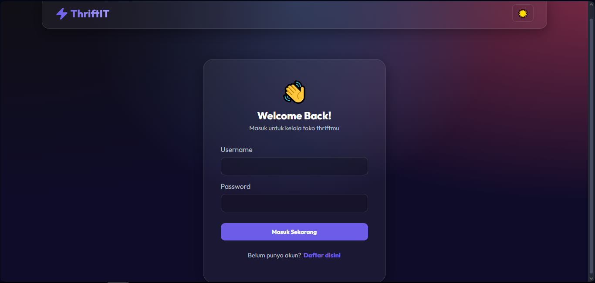

### B. Home
*Halaman utama menampilkan deskripsi dan fitur*
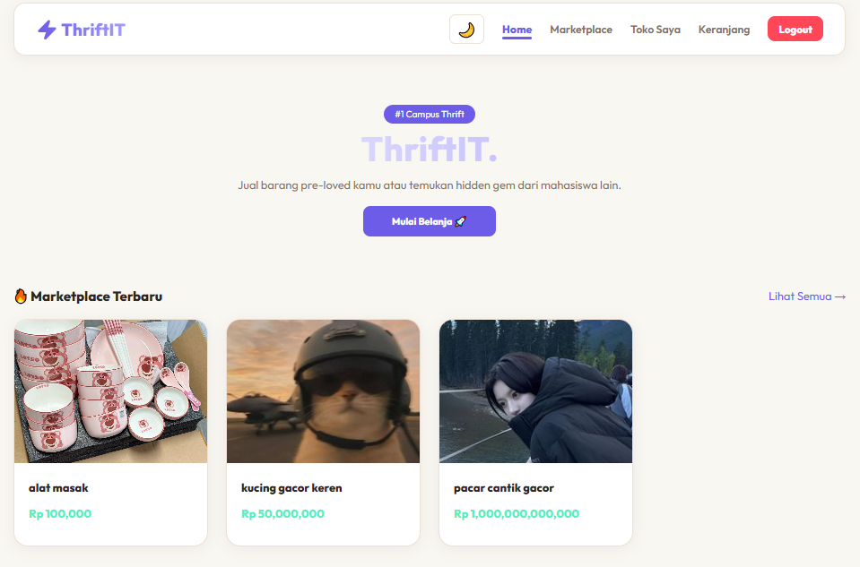
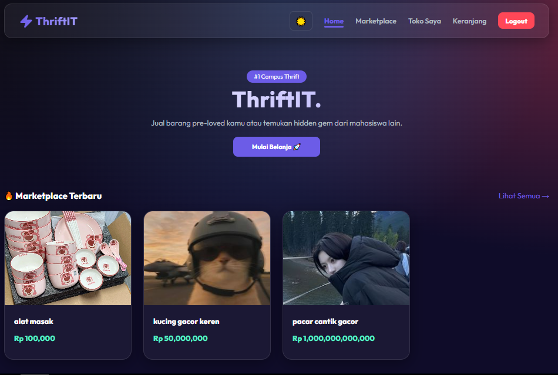

### C. Toko Saya (Manajemen Produk)
*Halaman pengelolaan barang jualan sendiri.*
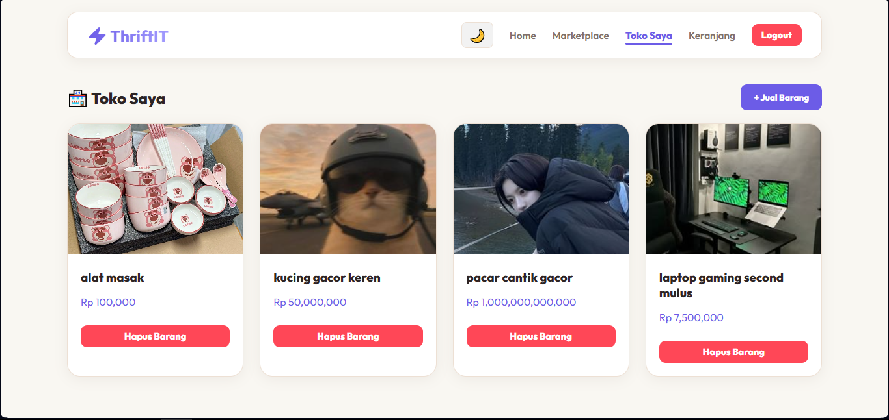
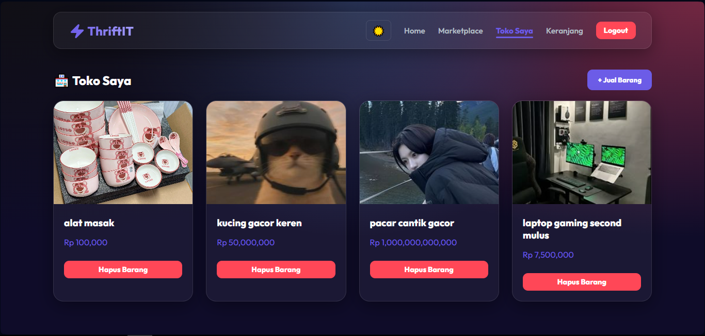

### D. Detail Produk & Keranjang
*Tampilan detail barang dan fitur masuk keranjang/checkout.*
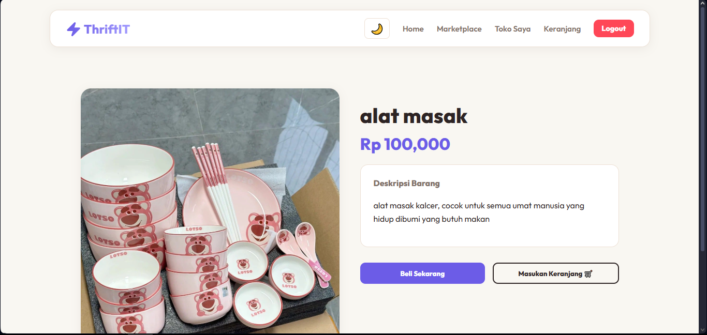
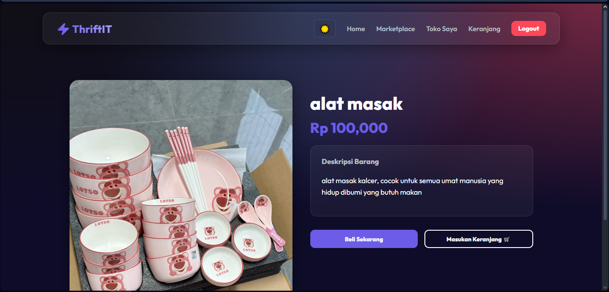
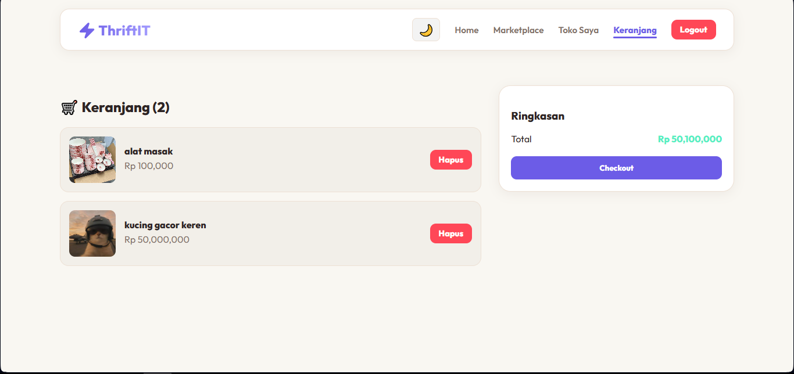
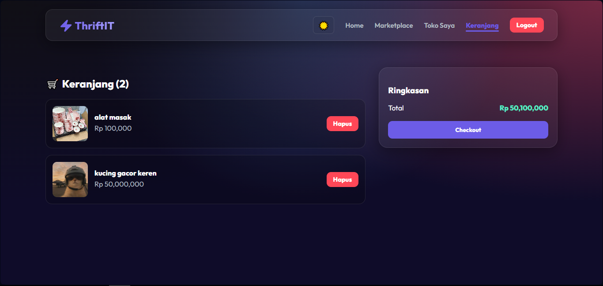

### E. Marketplace
*Tampilan data barang yang bisa dibeli dari barang dijual orang lain.*
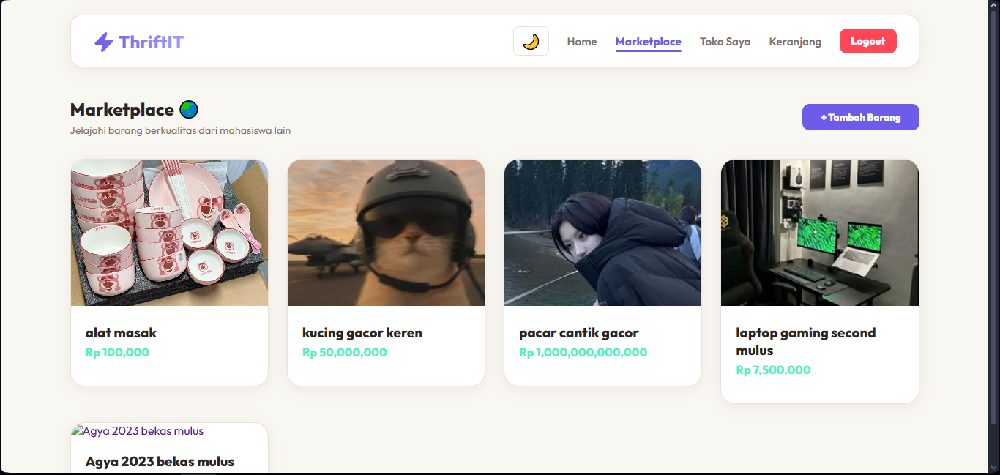
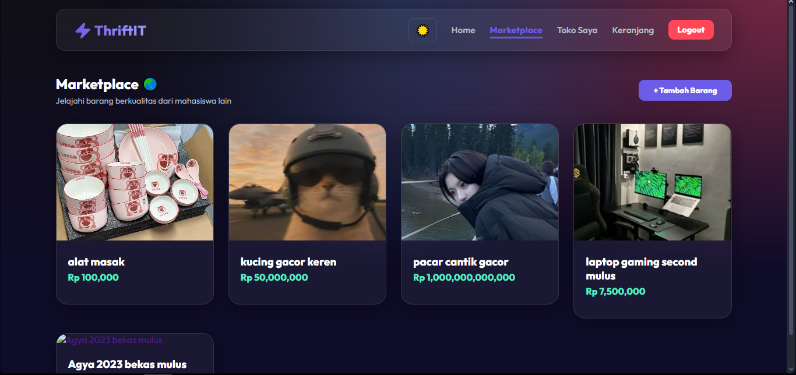

### F. Bukti Database (MongoDB)
*Data user dan produk yang berhasil tersimpan di MongoDB Compass.*
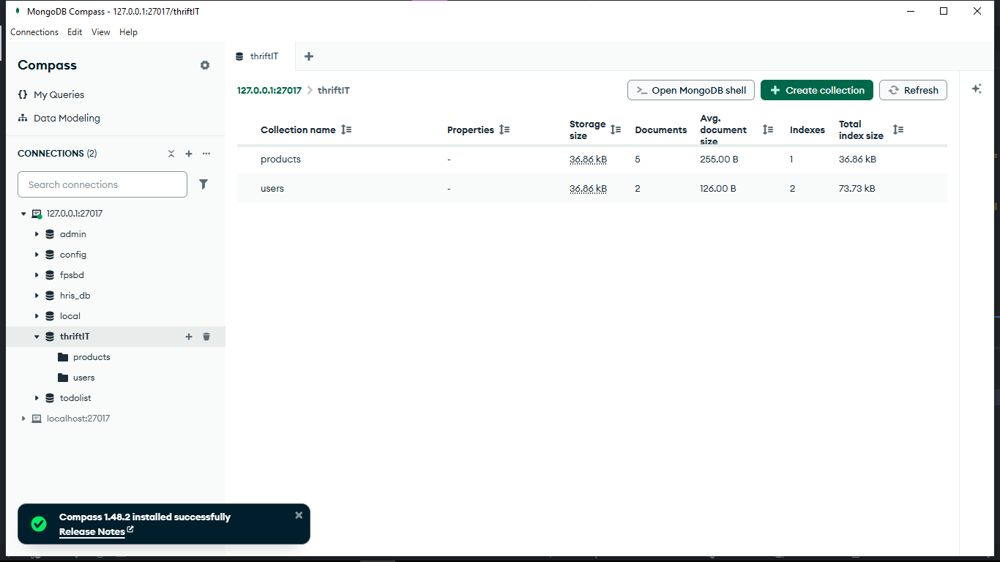
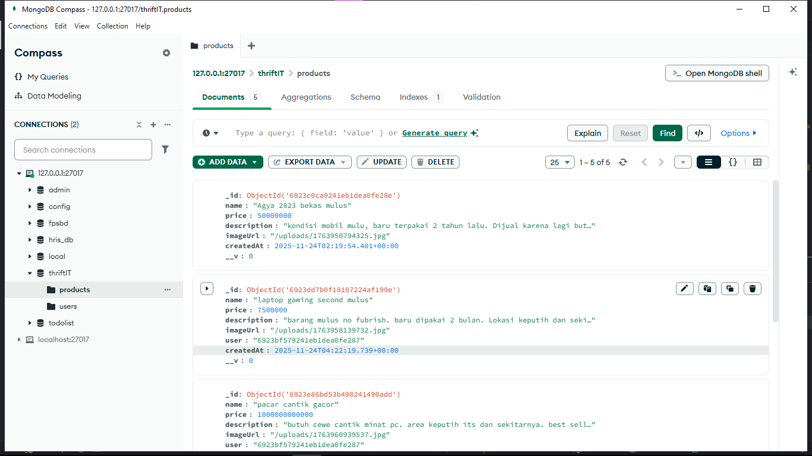
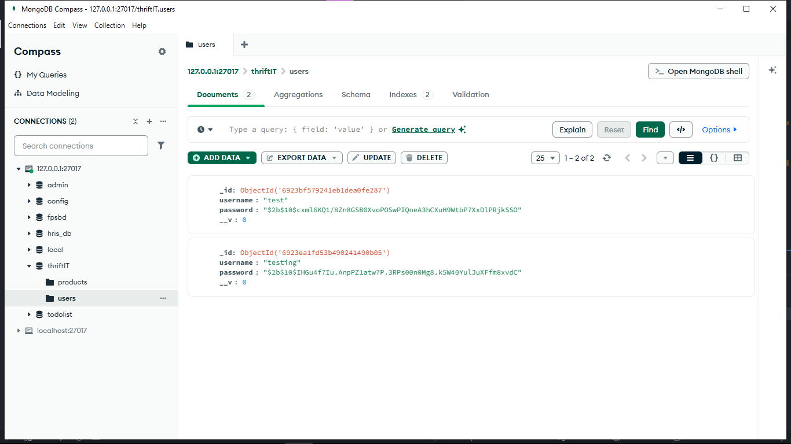

---

## 🚀 5. Cara Menjalankan Project (Setup Instructions)

Ikuti langkah-langkah berikut untuk menjalankan proyek ini di komputer lokal (Localhost).

### Prasyarat:
* Node.js & NPM sudah terinstall.
* MongoDB Community Server sudah berjalan.

### Langkah 1: Setup Backend (Server)
1.  Buka terminal, masuk ke folder backend:
    ```bash
    cd backend
    ```
2.  Install dependencies:
    ```bash
    npm install
    ```
3.  Pastikan file `.env` sudah dibuat dengan isi:
    ```env
    MONGO_URI=mongodb://127.0.0.1:27017/thriftIT
    JWT_SECRET=rahasia_negara_thrift_it_2025
    PORT=5000
    ```
4.  Jalankan server:
    ```bash
    node server.js
    ```
    *Pastikan muncul pesan: "MongoDB Connected"*

### Langkah 2: Setup Frontend (Client)
1.  Buka terminal baru, masuk ke folder frontend:
    ```bash
    cd frontend
    ```
2.  Install dependencies:
    ```bash
    npm install
    ```
3.  Jalankan aplikasi React:
    ```bash
    npm run dev
    ```
4.  Buka link yang muncul (biasanya `http://localhost:5173`) di browser.

### DISCLAIMER
Untuk penjualan barang, setiap akun hanya bisa menambahkan barang untuk dijual(toko saya). Sedangkan pada marketplace hanya menampilkan barang yang dijual oleh orang lain(akun lain) tidak barangnya sendiri. 

---

**Developed by Khumaidi Kharis Az-zacky - 5027241049**
*Tugas Vibe Coding Pemrograman Web*